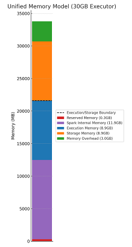

# Understanding Spark Internals: How Developer Choices Impact Performance 

# 1\. What You Need to Understand Before Optimizing Spark

This document assumes you're already familiar with how Spark works under the hood. If terms like executor, worker, driver, transformations, and actions are new to you, I recommend starting with some introductory materials first. A great resource is *"Spark: The Definitive Guide"* by Bill Chambers and Matei Zaharia.

If you're new to Spark performance tuning, consider reading this guide more than once. The topics are closely connected, and I’ll often refer back to concepts explained earlier or even later.

One more thing to keep in mind: Spark comes with many built-in performance optimizations. In most cases, performance issues come from job or cluster configurations or suboptimal code — often written with performance in mind, but without real validation. This is a common pattern: assumptions were made but never tested. That’s why you should test every change you make, even so-called "no-brainers" or obvious fixes. Sometimes, they disable internal optimizations and make your job slower instead of faster. Always test your changes — and if performance improves at the cost of breaking business logic, it’s probably not an optimization, it’s a bug.

# 2.Parallelism

Parallelism is one of the key factors affecting Spark performance. Almost all operations in Spark run in parallel across multiple executors. That’s why it’s important to always be aware of how many partitions, executors, and cores are in use at any given moment.

Keep in mind that the number of partitions can change during the job — especially after reading data or during shuffles. The number of executors and cores can change during the job if dynamic allocation is enabled or if you're using an auto scaling cluster manager or your job experiences worker failures.

## 2.1 How Many Partitions

When setting up a new Spark job, two of the most important configuration parameters to define are `spark.default.parallelism` and `spark.sql.shuffle.partitions`. The first is used as a default number of partitions for RDD operations, while the second applies to DataFrames and Datasets.

The optimal number of partitions depends on both your data size and the number of available CPU cores. A good rule of thumb is to target around 256MB per partition. You also want the total number of partitions to be a multiple of the total number of cores available across executors — this helps Spark schedule tasks more efficiently across executors.

Too few partitions (i.e., large partitions) can lead to slow execution, high GC pressure, long-running tasks, and poor distribution of work across the executors. On the other hand, too many small partitions can increase overhead during shuffles and place unnecessary load on the scheduler.

According to the Spark documentation, the scheduler is optimized to handle tasks as short as 200ms, but extremely short tasks might still introduce unnecessary overhead. So, avoid going too far in either direction — test and tune based on your cluster and data. If you don't have the comfort of performing a large number of test runs, it is usually better to pick a number too high than too low.

**As a rule of thumb, you can use the following formula:**

`number of executors × number of cores per executor × N`,

where N is a factor between 2 and 6, depending on the size and characteristics of your data.

## 2.2 How the Number of Partitions Changes During Job Execution

Many people assume that once parallelism is set, Spark will use that number of partitions throughout the entire job. That’s not true — but in most cases, it’s actually a good thing.

### Reading data

The first situation where the number of partitions might differ from what’s set in the configuration is during data reading. Most Spark data readers determine the number of partitions based on the source data and configuration.

For example, by default, reading Parquet files will result in one partition per file, but this behavior is influenced by parameters such as:

* `spark.sql.files.maxPartitionBytes` — limits the amount of data read into a single partition.

* `spark.sql.files.minPartitionNum` — suggests the minimum number of partitions to use when reading files.

Because of these factors, it’s hard to predict the number of partitions Spark will create when reading a DataFrame. The most reliable approach is to read the data and then inspect the partition count in the Spark UI. If it’s not suitable, adjust it right away.

### Unions

It’s not widely known, but `union` in most cases does not trigger a shuffle. Existing partitions stay where they are, and the resulting DataFrame simply combines all of them. So, the number of partitions will be the sum of all input DataFrames’ partitions.

This is important when combining many DataFrames — check the resulting partition count after the union and act accordingly.

### orderBy

Another case where the number of partitions may unexpectedly change is when using `orderBy`. The way Spark implements this method can result in an unpredictable number of partitions — and in some cases, data skew.

This is tricky because you typically don’t want to repartition an already sorted DataFrame. One potential solution is to introduce a new column with a random number, sort by your desired column(s) and the random column, then drop the random one:
```scala
df.withColumn("random", round(rand() * 200)) 
  .orderBy(desc("actual_order"), desc("random"))  
  .drop("random")`
```
This gives you a sorted DataFrame with more partitions and reduced skew.  
 More details: [Spark orderBy implementation – CloudSqale](https://cloudsqale.com/2023/11/26/spark-order-by-implementation/)

### repartition

This method is well-known for triggering a full shuffle and changing the number of partitions. What’s less obvious is that its behavior changes depending on which overloaded version you use:

* `.repartition(n)` — creates `n` partitions.

* `.repartition(col)` or `.repartition(col1, col2, ...)` — uses a hash of the column(s) to assign rows to partitions. To decide how many partitions to create Spark will use `spark.default.parallelism` if set or it will infer the partition count based on upstream RDDs.

* `.repartition(n, col)` — does both: sets the number of partitions and uses a hash based on the specified column(s).

These variants all perform a full shuffle, using a hash-based partitioning strategy internally. Especially if you provide columns yourself, this may result in imbalanced partitions, and in some cases, even empty ones.

### coalesce

`coalesce` is used to reduce the number of partitions. It’s often seen as a cheaper alternative to repartition, because it avoids a full shuffle — but that comes with trade-offs.

Since `coalesce` only merges existing partitions and doesn’t reshuffle the data, it cannot fix skew. In fact, it can sometimes create skew by merging partitions unevenly, resulting in some being significantly larger than others.

### Other Wide Transformations

As we all know, wide transformations create a new stage and trigger a full shuffle. The key question is: *how many partitions should we expect after such a shuffle?*

This is where `spark.default.parallelism` and `spark.sql.shuffle.partitions` finally come into play. After a shuffle caused by wide transformations like `join`, `aggregate`, etc., the resulting number of partitions will match the value you've set in the configuration.

You might think this number isn’t all that important — but the truth is, wide transformations are the most common reason for partition count changes. In most Spark jobs, the majority of stages run with the configured shuffle partition count, simply because they follow at least one wide transformation and the shuffle it triggered.

## 2.3 Executors, Cores and Memory

Choosing the right executor configuration is one of the most impactful tuning decisions in Spark. It affects not only how fast your job runs, but also how stable and efficient it is. We’ll look at both isolated and multi-tenant environments, and explain common trade-offs that affect performance, stability, and resource efficiency.

The number and characteristic of executors should satisfy three conditions:

* Efficient use of compute resources

* Sufficient memory, CPU, and disk capacity to handle the workload

* Avoid over-provisioning resources

In many cases, Spark jobs only satisfy the second condition \- sufficient capacity \- while assuming the other two are covered as well.

### 2.3.1 Understanding the Environment

To use resources efficiently, you need to understand the available memory, CPU cores, and disk space in your cluster, and how much your job will actually use. The problem is often less visible in large multi-tenant environments where resource managers like YARN can balance workloads across many users. You can often ignore the underlying hardware to some extent and simply choose the number of cores and amount of memory that best fit your workload \- assuming that other users will make use of any leftover resources on the worker nodes.

But the same isn’t always true in cloud deployments, where Spark jobs often run in isolated, on-demand clusters.In this case, you need to understand the specs of your worker nodes. How much memory and how many cores each one has—and calculate how many executor containers will fit.

For example, if a worker node has 32 cores and 256 GB of RAM, and you configure each executor with 6 cores and 64 GB RAM, basic math suggests that 4 executors can run per node. They’ll use 24 cores and all 256 GB of RAM. That leaves 8 cores idle. But in reality, it's often worse. Due to memory overhead, Spark may only launch 3 executors per node, depending on the configured memory overhead settings \- wasting part of 64 GB and 18 CPU cores.

Choosing the right executor configuration isn’t just about assigning as much resources as you can. You also need to consider how much your job actually needs. This isn't always easy to determine because there's a point when adding more resources may lead to diminishing returns. A good starting point is to identify the minimum number of CPU cores and the memory needed to run the job. From there, you can look for the sweet spot between performance, cost, and cluster utilization. You can usually estimate the number of needed cores based on the number of partitions you expect to run in parallel, which in turn can help to determine how many executors and how much memory you’ll need. More on that below.

### 2.3.2 Optimal Number of Cores and Memory per Executor

You need to understand that the number of cores assigned to an executor determines how many partitions it can process in parallel. This means the number of cores should be balanced with the amount of memory allocated. The more cores you give an executor, the more memory it will need. If your executors are dying due to OOM (Out of Memory) errors, reducing the number of cores per executor lowers task-level concurrency, which can reduce memory pressure and help avoid OOMs, though this might impact parallelism and throughput. Less disruptive methods to handle OOMs will be discussed later in this article.

Another configuration worth knowing is `spark.task.cpus`, which controls how many CPU cores a single task requires. By default, it's set to 1, meaning each task uses one core. 

However, if your tasks are designed to be multi-threaded or involve native libraries (like in Spark MLlib or some UDFs), you might want to increase this value. Doing so tells Spark to schedule fewer tasks per executor, ensuring each task gets enough compute resources. Keep in mind that this setting affects how many tasks can run in parallel, so it should be balanced carefully with the number of executor cores.

A common first instinct is to allocate as many cores and as much memory per executor as your hardware allows. But this is usually not ideal. Spark tends to perform better with smaller executors, for several reasons.

First, executors can fail. If your application loses a small executor, the impact is smaller: fewer partitions lost, less cached data gone, and less work to recover. It’s easier to spin up a new executor and continue.

Second, garbage collection. Java garbage collectors can be tricky to tune. You should check which GC your JVM is using and how well it handles large heaps. In general, smaller heaps are easier and faster to manage, which means your Spark app spends less time paused during GC. That’s important, since many GCs pause the whole JVM while running. This impact can vary depending on which GC is used—older ones cause full pauses, while newer ones like G1GC or ZGC are more concurrent and less disruptive.

Third, practicality. Besides executors, your app has a driver, which also needs to run on the cluster. The driver typically uses fewer resources than the executors, and it’s often best to run it on a node that also runs executors.

Fourth, if you're on a multi-tenant cluster, smaller executors are easier for the scheduler to fit into partially used nodes. Your job can take advantage of leftover resources that larger executors can’t use. This also improves data locality—it’s easier to schedule an executor on a node that already holds the needed data.

Big executors have some benefits too. Broadcasting data is more memory-efficient with fewer, larger executors. Some operations also run faster within a single JVM due to shared memory access and reduced need for serialization. You also save a bit on memory overhead and Spark’s reserved memory, but not as much as you might expect, since larger executors need larger overhead buffers too. You might need to fine tune the `spark.executor.memoryOverhead` parameter.

A common starting point is to assign 2–5 cores and 8–32GB of memory per executor. Don’t treat these numbers as strict rules—your ideal setup depends heavily on your specific workload and available resources. Use them as a baseline and test how your job behaves with different configurations.

If you're using Spark's dynamic allocation, keep in mind that executors count can change automatically at runtime. With this feature enabled, Spark will add or remove executors based on the workload, which helps optimize resource usage across multiple jobs or stages. While dynamic allocation is useful in shared or elastic environments (like YARN or Kubernetes), it can sometimes conflict with manual tuning, especially if your job relies on consistent executor sizes or cached data. It's important to test how your application behaves with and without it before deciding on static versus dynamic resource configuration. Caching and dynamic allocation will be discussed later.

If you're using HDFS and YARN, it’s often said that 5 cores per executor works best, due to how HDFS handles I/O. While that advice is a bit dated, it still gets mentioned, but with modern hardware and storage systems, this should be validated for your workload.

Finally, if you're running on an isolated cluster and know your hardware specs, remember to leave some resources for the operating system and your cluster scheduler.

### 2.3.3 How to Pick the Right Numbers

To sum up the information available earlier, I prepared a simple step by step plan on how to pick the right number of executors and their specifications. Please note that you may actually make better decisions if you read next chapters, especially those on Spark memory model.

1. **Understand your workload**  
   How much data will you read? What are you going to do with the data? Will the data volume increase or decrease during execution? Are the operations CPU or memory intensive? Will you use caching?

2. **Estimate the required parallelism**  
   Use the number of partitions to estimate how many cores you'll need in total.

3. **Check node and cluster specs**  
   How many CPU cores, how much memory, and how much disk space is available per worker node? What are the total available resources in the cluster?

4. **Start with a baseline**  
   Choose reasonable executor specs based on the above. Make sure each executor fits on a node (CPU \+ memory), and leave some overhead. Ensure memory is sufficient for the number of cores and expected partition sizes. A common starting point is 2–5 cores and 8–32 GB memory per executor.

5. **Run tests and monitor with the Spark UI**  
   Look at task concurrency, garbage collection (GC) time, out-of-memory (OOM) errors, shuffle sizes, spills, storage memory usage, and disk usage. Pay special attention to GC time and storage memory, as they’re often early indicators of poor executor sizing.

6. **Iterate and adjust**  
   Try different executor configurations. Observe how your job behaves when you change executor count or size. Note changes in execution time and resource usage.

7. **Consider dynamic allocation carefully**  
   Test your job with dynamic allocation on and off, depending on workload type and caching behavior. If your job relies on cached datasets, turning on dynamic allocation may lead to unexpected eviction and performance drops.

# 3\. Memory and Cache

In this chapter, I’ll explain how Spark’s memory model works. Many developers don’t realize that Spark divides executor memory into several smaller pools for different purposes. Understanding this is crucial when setting executor memory, troubleshooting OOM (Out Of Memory) errors, and caching data efficiently.

## 3.1 How Memory Works in Spark

Since version 1.6, Spark uses a unified memory model, meaning execution and storage share the same memory pool. This design helps maximize memory utilization, but it comes with trade-offs that can affect performance and job stability.

Let’s walk through an example with an executor configured with 30 GB of heap memory (`spark.executor.memory`).  
Before Spark applies any configuration, it reserves 300 MB of this heap memory for internal use. This is a hardcoded buffer to guard against memory pressure and is not configurable. The remaining 29.7 GB is then subject to the `spark.memory.fraction` setting, which defaults to 0.6. That gives us approximately 17.8 GB of memory available to the unified memory pool.

The rest (about 11.9 GB of heap memory) is left for Spark’s internal bookkeeping, user data structures, task metadata, and other JVM operations outside of the unified memory pool.

Unified memory is further divided into execution memory and storage memory, controlled by the `spark.memory.storageFraction` parameter (default 0.5). This gives each pool roughly 8.9 GB. Spark dynamically adjusts this split at runtime — if execution needs more space, it can borrow from storage by evicting cached blocks. However, the other way araound is not possible: storage cannot reclaim execution memory if it's needed, therefore sometimes cache will claim all unified memory just to be evicted moments later. If eviction happens frequently, it can negatively impact performance, so tuning these settings may be necessary for cache-heavy or memory-intensive workloads.

On top of the JVM heap memory (`spark.executor.memory`), Spark also allocates additional memory called *memory overhead*, configured via `spark.executor.memoryOverhead` or calculated using `spark.executor.memoryOverheadFactor`. This memory is outside of the executor heap and is used by the container for off-heap allocations, shuffle buffers, native libraries, and other non-heap tasks.

If `spark.executor.memoryOverhead` is not set explicitly, Spark will use the larger of 384 MB or the value calculated by `spark.executor.memoryOverheadFactor * spark.executor.memory`. This distinction is important when allocating executor resources in a cluster, especially under YARN or Kubernetes, where the total container memory \= executor memory \+ memory overhead.



If your application uses off-heap memory explicitly (e.g., with Tungsten or native libraries), and you're running Spark 3.0 or later, be aware of the `spark.memory.offHeap.size` setting. This defines an additional off-heap memory pool and must be considered separately from memory overhead. It’s not part of the JVM heap and not part of the memory overhead either — it is extra memory that your executor container will consume, and must be accounted for when sizing executors.

The same applies to PySpark. Python workers run as separate processes and consume memory outside the JVM. The setting `spark.executor.pyspark.memory` defines how much memory each Python worker is allocated. Additionally, `spark.python.worker.memory` sets the amount of JVM memory reserved per Python worker.

## 3.2 Cache Storage Levels

Spark provides several storage levels you can use when caching data. By default, when you call `.cache`, it uses `MEMORY_AND_DISK` for DataFrames and `MEMORY_ONLY` for RDDs. If you want to choose a specific storage level, you need to use `.persist`. Many users don’t realize that caching affects execution memory, which can negatively impact performance and stability. You can mitigate this by selecting an appropriate storage level. Let’s review the available options:

**MEMORY\_ONLY**  
This level Spark stores all cached data in memory. If the data is too large to fit, only part of it will be cached; the rest will be recomputed whenever needed. MEMORY\_ONLY is often the fastest if all data fits in memory, but if it doesn’t, the cost of recomputation can make it slower than MEMORY\_AND\_DISK in practice. The downside is that this uses the most memory. 

**MEMORY\_AND\_DISK**  
This level is similar to `MEMORY_ONLY`, but if the data doesn’t fit in memory, Spark will serialize it and write it to the worker node’s local disk. Local disk access is slower than memory but may still provide decent performance gains. However, spilling to disk is a relatively slow operation. It also consumes CPU to serialize the data and uses memory for buffering. If you expect your job to spill to disk, it might be better to choose a level that uses less memory upfront to avoid eviction. In some cases, memory pressure from evictions can cause executors to crash, which may lead to job failure.

**MEMORY\_ONLY\_SER and MEMORY\_AND\_DISK\_SER**  
These levels are similar to the ones above but always store data in serialized form—even in memory. This can significantly reduce memory usage for RDDs and some Datasets, as raw Java objects typically consume more space due to JVM overhead. You can even enable in-memory compression for that data, which will be explained later. For DataFrames, however, the benefit is often smaller or negligible, since Spark already uses `UnsafeRow`, a compact binary format.

One advantage of serialized caching is that Spark avoids additional serialization when spilling to disk or transferring data over the network (e.g., during shuffles), which can reduce CPU overhead. If you use serialized storage levels, consider enabling Kryo serialization, which is faster and more memory-efficient than Java serialization. Serialization details are covered later in this document.

**DISK\_ONLY**  
With this level, all cached data is stored on a local disk. It won’t consume memory and is always serialized. This frees up execution memory and removes the risk of eviction due to memory pressure, which can improve job stability if memory is tight. DISK\_ONLY should be used carefully—it avoids memory pressure but can significantly slow down iterative algorithms due to repeated disk access.  
Be mindful of available disk space, especially when running on cloud platforms—some worker nodes may have limited disk capacity. 

**OFF\_HEAP**

This level allows Spark to store data outside of the JVM heap using Tungsten memory management. This can reduce garbage collection overhead and improve performance for large datasets. To use it, you must enable `spark.memory.offHeap.enabled` and set `spark.memory.offHeap.size`. It's mostly used in advanced tuning scenarios where memory pressure or GC pauses are a problem.

## 3.3 Choosing a Storage Level and Utilizing Cache

### In general:

* Small datasets that fit in memory benefit from `MEMORY_ONLY`.  
* As data grows, you may need to enable disk usage to avoid evictions.  
* For RDDs and some Datasets it might be a good idea to enable serialization in memory  
* For very large datasets, `DISK_ONLY` might be the only feasible caching option.  
* `OFF_HEAP` is still sparsely used and it is a tool for advanced memory tuning.

Avoid using too much memory for caching, as this can interfere with execution memory and cause evictions at critical times leading to executor failures and unstable jobs. 

### **Use .`unpersist()`**

When cached data is no longer needed, it’s best to call `.unpersist()`. While Spark can evict cached data automatically, manually unpersisting avoids unnecessary disk spills and helps free up resources at the right time. Spark uses LRU (least-recently-used) eviction, but it doesn’t guarantee immediate cleanup. In fact it will most probably happen when the memory is already needed for something else.

### **Cache is Lazy**

This guide is aimed at experienced Spark users, but this point is worth repeating: caching for DataFrames and RDDs is lazy, just like everything else in Spark. It’s part of the DataFrame lineage and won't take effect unless an action is triggered on the cached DataFrame.

The following code does not cache anything:

`val df = spark.read.parquet("/tmp/spark_input")`  
`df.cache`  
`df.write.parquet("/tmp/spark_output")`

To cache the data properly, you must call `.cache` on the DataFrame and then trigger an action on that result:

`val df = spark.read.parquet("/tmp/spark_input").cache`  
`df.write.parquet("/tmp/spark_output")`

## 3.4 How Big Is the Cached Data

The size of cached data in memory can be difficult to estimate. While you might expect it to be similar to the input file size, that’s not always the case. Input files (e.g., Parquet) are often compressed and columnar, which affects how much data is actually read and materialized in memory. Once loaded, Spark caches data based on used API and the chosen storage level, which may keep data as raw JVM objects, `UnsafeRow` or as serialized byte arrays. Different data types, schemas, and serialization formats (like Java or Kryo) can result in significantly different memory footprints. 

The simplest way to see the actual memory usage is to load the data into Spark, cache it, and check the Storage tab in the Spark UI.

# 4\. Jobs, Stages, Tasks and Shuffles

I assume most readers are already familiar with these concepts, but to make the next chapter easier to follow, I want to make sure we're all on the same page.

Jobs are created when an action is triggered, and they encompass the set of transformations needed to compute the result. Each job is divided into stages, and each stage consists of tasks. A new stage is usually created whenever Spark needs to perform a shuffle, which usually happens due to a wide transformation. While shuffles are the main reason new stages are created, in some edge cases, execution boundaries or resource constraints can also introduce new stages. Tasks execute all the operations defined in a stage on a single partition. This means that a task in such a stage performs all pipelined operations in sequence on its partition. It is important to understand this as this directly impacts how much new transformations will impact the performance.

This means that by looking at the number of jobs, you can see how many actions your application triggers.The number of stages can help you estimate how many shuffle boundaries your job has, though not every stage corresponds to a shuffle. The number of tasks per stage shows how many operations are performed in parallel within that stage.

When using the DataFrame or SQL API, Spark creates a logical and physical plan for each job. These plans are then optimized before execution. For RDDs, planning is more straightforward and lacks Catalyst optimizations.

## 4.1 Shuffle

Shuffles are a key concept in Spark, central to both its performance and how work is distributed across a cluster. Spark pipelines narrow transformations in a stage to optimize execution. A shuffle introduces a stage boundary where pipelining stops and new tasks begin. Unfortunately, this topic is often poorly understood by Spark users. Many only recognize that it "happens when data needs to be distributed," without knowing the full cost involved. In reality, shuffles are resource-intensive—they consume disk and network I/O, CPU, memory, and involve serialization. They can also put significant pressure on the garbage collector (GC). Since shuffle behavior has become more complex in recent Spark versions, the following explanation simplifies the main concepts. 

### **4.1.1 Shuffle Phases**

**1\. Fetch Phase**  
The first step of a shuffle is the *fetch* phase, where an executor retrieves the output data from a previous stage. This data might come from a local executor or a remote one. Depending on the data source, Spark may fetch data from memory, disk, or over the network. This can involve serialization, compression, and significant I/O. If an executor detects that a remote source has failed, Spark will fail the current stage and recompute the lost data by rerunning earlier stages.

**2\. Compute Phase**  
 In this phase, the fetched data is processed. All necessary transformations required to compute the target partition are applied. Only the transformations defined in the current stage are applied to the fetched data. Upstream transformations are already materialized in shuffle files. The result is a new partition ready to be written out.

**3\. Write Phase**  
 This phase is particularly important, as the choice of shuffle writer has a major impact on performance. Spark uses three main implementations:

* **BypassMergeSortShuffleWriter**: Used when the number of output partitions is below the `bypassMergeThreshold`. It is the fastest option but doesn't scale well, so the default threshold is usually sufficient. It is efficient when there are few partitions and no map-side combining, but it's not suitable for all workloads.

* **UnsafeShuffleWriter**: Used with DataFrames when Spark operates on `UnsafeRow`s and the serializer supports relocation (e.g., Kryo does; JavaSerializer doesn’t). This is also a high-performance option.

* **SortShuffleWriter**: The fallback which is slower than specialized writers. It’s used in all other cases, it supports all shuffle features like map-side combine and fallback spilling.

### **4.1.2 Memory, Disk Spill, and GC Pressure**

A critical point to understand is that the shuffle output might not fit entirely in memory. How much memory is used depends on the shuffle writer, the size of the data, and the operation that triggered the shuffle. When memory is insufficient, the *BlockManager* may spill data to disk. This adds overhead: data needs to be serialized and possibly compressed before it's written, and disk I/O is much slower than memory access. During spilling, data may be evicted from memory based on memory pressure, and GC may be triggered depending on memory usage and JVM heap behavior.

### **4.1.3 Techniques to Minimize Disk Spill**

There are several strategies to reduce the chance and impact of shuffle spills:

* Use broadcast joins where possible, especially when one dataset is small.

* Repartition data strategically to avoid skew and large partitions. Skewed keys can lead to heavily imbalanced partitions and large spills. Techniques like key salting or custom partitioners can help mitigate this.

* Choose an efficient serializer (Kryo over Java, for example).

* Tune compression settings based on your data size and workload. Compression reduces I/O but increases CPU usage. It's useful for large shuffle volumes, but may hurt performance if CPU is the bottleneck.

* Avoid unnecessary caching, which can put extra pressure on executor memory.

### **4.1.4 Shuffle Performance is Config-Dependent**

The overall performance of shuffle operations is heavily influenced by the chosen serializer, compression algorithm, partitioning strategy, and even seemingly unrelated Spark configuration settings. Many of these factors will be discussed in detail later in this document.

### **4.1.4 Map-side Combine**

One useful trick Spark uses to make shuffles faster is called map-side combine. It means that Spark tries to do some of the aggregation earlier, before sending data across the network. For example, if you’re doing a `groupBy` followed by a sum, Spark can start adding some of the values *before* shuffling the data. This way, it sends less data over the network, which makes the job faster and uses fewer resources.

This works automatically when you use RDDs with transformations like `reduceByKey`, `combineByKey` or `aggregateByKey`. It does not work for `groupByKey` so choose the former if possible.  

When you use DataFrames, it depends on how Catalyst decides to build the plan. Sometimes it will apply map-side combine, sometimes not, depending on the query and data. So with DataFrames, you don’t have as much control, but you can trust Spark to make smart choices in most cases.

# 5\. Broadcasts

Broadcast variables allow you to send a read-only piece of data to all executors in your Spark application. Spark uses them internally, but as a user, you can manually broadcast data too.

However, like many performance features, broadcasting is a double-edged sword. Broadcast data is physically sent to every active and future executor, and by default, it’s stored in memory—similar to how cached data behaves. This means broadcasting a 1 GB dataset across 100 executors can consume up to 100 GB of cluster memory. While this can avoid expensive shuffles and improve performance, it comes at a high resource cost.

Another consideration is that broadcasted data must be successfully sent within a timeout window. If it takes too long—for example, due to network delays or cluster load—your job may fail.

A common use case is the broadcast join. If you're joining a large table with a much smaller one, broadcasting the small table allows each executor to perform the join locally, avoiding the need to shuffle the larger dataset. Spark supports this optimization automatically: if the small table is under a certain size threshold, Spark will choose a broadcast join on its own.

The threshold is controlled by the `spark.sql.autoBroadcastJoinThreshold` setting (default: 10MB). You can increase or decrease this value depending on your data and available memory. However, forcing a broadcast join (e.g., using `broadcast(df)` in code) is risky—if the dataset later grows beyond expected size, your job may run out of memory or fail.

Also, setting `autoBroadcastJoinThreshold = -1` disables automatic broadcast joins, but it does not disable forced broadcasts. If you manually call `broadcast()`, Spark will always attempt to broadcast the data, regardless of size or threshold. In such cases, the only way to avoid the broadcast is to remove or refactor the code that triggers it.

To make sure Spark actually applied a broadcast join—or to debug whether it didn’t—you can use a few different tools:

1\. Use .explain() and look for BroadcastExchange in the physical plan.

2\. Check the Spark UI (SQL Tab) and look for BroadcastExchange in the physical plan.

If Spark planned a broadcast join but the table was too large or something failed (like timeout), it may silently fall back to a SortMergeJoin.

# 6\. Data Locality

Data locality affects the performance of your Spark jobs. If the cluster manager supports it, Spark will try to schedule tasks on executors that are close to the data. This improves performance by reducing data transfer over the network. However, executor placement is handled by the cluster manager so data-local execution is not always possible. For example, the scheduler might not find available resources on the target node, or launching an executor on the desired node might take too long.

There are currently five levels of data locality, ranked from best to worst:

* **PROCESS\_LOCAL** – The data is available in the same JVM as the task. This typically happens when the data is cached in memory on the same executor.

* **NODE\_LOCAL** – The data is on the same physical machine as the executor, but not necessarily in the same JVM. It could be on a local disk or cached by another executor on the same node.

* **NO\_PREF** – The job doesn’t have any location preference for its data. This usually applies to synthetic data (e.g., from `sc.parallelize`) or when data is generated in memory.

* **RACK\_LOCAL** – The data is stored on a different node but within the same rack. This adds some network overhead but is still faster than cross-rack transfers.

* **ANY** – The data is on a different rack or in remote storage. This is the least optimal scenario in terms of performance.

Different cluster managers handle data locality differently. YARN offers the most mature support for locality-aware scheduling, especially when using HDFS, where block locations help Spark schedule tasks close to the data. Spark's standalone cluster mode also supports data locality, but only for cached RDDs or shuffle data stored on local disk — in these cases, we can observe `PROCESS_LOCAL` and `NODE_LOCAL` levels.

The same applies to Kubernetes, which does not provide native awareness of data placement. Executors are scheduled as independent pods, and Kubernetes does not expose node-level data locality to Spark. In most cloud-native Spark setups running on Kubernetes, data is read from remote object stores like S3 or GCS. While `PROCESS_LOCAL` and `NODE_LOCAL` can still occur for cached data or shuffle files, most data access happens over the network, so tasks typically fall back to `ANY` locality.

Spark also uses a locality wait strategy. By default, it waits a short time (configured via `spark.locality.wait`) to try and schedule tasks at the best locality level. If it can't, it will fall back to the next level. Tuning these wait times (`spark.locality.wait.node`, `spark.locality.wait.process`, `spark.locality.wait.rack`, etc.) can significantly impact job performance.

In batch workloads, longer wait times can improve data locality and reduce network I/O, especially when tasks are working with large, cached datasets. However, setting them too high might cause unnecessary delays if cluster resources are constrained.

In streaming jobs, minimizing latency is usually more important than perfect locality. In this case, reducing or even disabling locality wait times (e.g., setting them to `0s`) helps tasks start immediately, even if the data isn’t local.

# 7\. Serialization

This was mentioned several times in the previous chapters. As all developers know, serialization must happen every time data needs to leave the JVM and be written to disk or transferred across the network to another process. The performance of this process directly affects the overall performance of a Spark job, as it influences several key operations such as shuffling, caching, and spilling to disk. For that reason, choosing the right serializer is a critical decision.

By default, Spark uses the `JavaSerializer`, which is a safe and convenient option since it can serialize any object that implements the `java.io.Serializable` interface. However, this serializer is not optimized for performance. It produces large serialized representations and is relatively slow.

To address this, Spark provides the `KryoSerializer`, which is significantly faster and more efficient in terms of memory usage. Objects serialized with Kryo generally have a much smaller memory footprint, and this difference can have a major impact on large-scale jobs. Many benchmarks are available online demonstrating how Kryo outperforms the default Java serializer in both speed and size, often by a large margin.

Kryo can serialize many standard Scala and Java types using reflection, but for complex or non-standard types (e.g., some third-party classes or inner classes), you may need to register them or provide custom serializers. In practice, this is rarely required, as most data structures commonly used in Spark workloads (e.g., case classes, arrays, collections) are already supported.

If you decide to use Kryo, make sure to enable it explicitly by setting  `spark.serializer` to `org.apache.spark.serializer.KryoSerializer`

To improve performance further, you can register frequently used classes with Kryo using `spark.kryo.classesToRegister`

This assigns small numeric identifiers to classes instead of full names, making serialization faster and serialized output smaller. In most cases, registering frequently used or custom classes provides a measurable boost. It’s especially beneficial in workloads with large object graphs, custom data types, or heavy network I/O (like wide shuffles).

You can also control the Kryo buffer size and other settings using `spark.kryoserializer.buffer` and `spark.kryoserializer.buffer.max`  
The default buffer size is `64k`, which works well for small to medium objects. However, if you are working with larger or deeply nested objects, you may hit buffer overflow errors (e.g., `BufferOverflowException`). To avoid this, you can increase the buffer size and set an upper limit.

In my experience switching to Kryo is almost always worth the effort due to the performance gains it offers.

# 8\. Compression Algorithm

Spark supports 4 different compression algorithms: LZ4, LZF, Snappy, and ZStd. The choice of compression can affect performance because each codec uses CPU and memory differently. 

LZ4 is fast and CPU-efficient but provides a lower compression ratio. It works well for low-latency workloads (for example streaming apps) or cases where CPU is the bottleneck. It is the default for internal I/O compression, controlled by `spark.io.compression.codec`.

ZStd achieves much better compression at the cost of higher CPU utilization. However, reducing data size can sometimes reduce GC pressure and I/O, improving overall job stability and throughput. ZStd is especially useful for workloads sensitive to memory usage or running on memory-constrained clusters. The trade off is that it increases task duration slightly.  In the latest Spark versions it is default for orc files (`spark.sql.orc.compression.codec`) and for event logs. (`spark.eventLog.compression.codec`)

Snappy remains a commonly used middle-ground codec. It’s fast and reasonably efficient. Does not offer compression level configurability. It is used by default for avro and parquet files. (`spark.sql.avro.compression.codec` and `spark.sql.parquet.compression.codec`)

LZF is largely legacy but supports parallel compression starting in Spark 4.0.0.

The codecs are configurable. Advanced tuning options are:

* LZ4 block size: `spark.io.compression.lz4.blockSize` (default: `32k`). Increasing it (e.g., `64k` or `128k`) can improve throughput, especially on disk I/O-heavy workloads, but increases memory usage during decompression.

* Snappy block size: `spark.io.compression.snappy.blockSize` (default: `32k`). The same benefits and cons as for lz4 block size apply. 

* ZStd level and buffer size:

  * `spark.io.compression.zstd.level` (default: `1`). Ranges from 1 (fastest) to 22 (highest compression). Level 3–5 often offers a good trade-off.  
  * `spark.io.compression.zstd.bufferSize` controls buffering. Higher values can improve throughput but will use more memory.  
  * `spark.io.compression.zstd.async` (default: `false`) enables asynchronous compression in Spark 4.0.0

* LZF parallelism: `spark.io.compression.lzf.parallel` (default: `false`) enables multi-threaded compression in Spark 4.0.0.

The chosen IO compression algorithm (`spark.io.compression.codec`) is used for broadcasts, shuffle spill files, cached RDD blocks spilled to disk, and network I/O. See `spark.shuffle.compress`, `spark.shuffle.spill.compress`, and `spark.broadcast.compress`. You can also enable compression for checkpoints (`spark.checkpoint.compress`) and serialized RDD storage (`spark.rdd.compress`), which reduces memory usage in exchange for CPU.

You can also choose the compression codec when writing output files. If you pay for storage by the GB, using a more efficient codec—like ZStd with a higher compression level—can reduce costs. For example, Uber reported a 39% reduction in file size when switching from Snappy to ZStd in Parquet, with better query performance as well. The full article is here: https://www.uber.com/en-PL/blog/cost-efficiency-big-data/

# 9\. Order of Operations

While Spark provides advanced features and logical plan optimizations, there are scenarios where manually adjusting the order of transformations and actions can significantly improve performance. First of all, some features are only available when using DataFrames. If you're working with RDDs, some optimizations (e.g., projection pruning) won’t be applied. Another case where Spark's built-in logical optimizations may not help is caching. Often, Spark lacks information about future usage patterns of cached data, which limits its ability to optimize.

## 9.1 Guidelines to Follow

1. **Apply filters as early as possible.**  
   Early filtering reduces the amount of data flowing through the pipeline, improving the performance of all downstream transformations and shuffles. In addition, filtering can introduce or reveal data skew. Doing it early increases the likelihood that Spark can detect and handle the skew during necessary shuffles, avoiding additional shuffles later.  
2. **Use `select()` explicitly to mimic projection pruning** in scenarios where Spark won't apply it automatically — for example, before caching, or when the final action involves writing to storage. It won’t reduce the amount of data read if the source doesn’t support it but can reduce the number of columns carried forward, minimizing memory usage and shuffle size.  
3. **Consider cache usage when planning the execution order.**  
   If you rely heavily on caching, think about how to structure your jobs to make better use of storage memory. You might be able to reorder jobs so that less data is cached at any point in time.  
4. **Cache data at the right moment.**  
   Ideally, cache when the data has been maximally reduced and the transformation lineage is near completion. This ensures you're storing compact, useful results.  
   Sometimes, you’ll need to cache earlier — for example if upcoming transformations explode the dataset (e.g., via `explode`, `join`, or `flatMap`), making it safer to cache beforehand due to memory constraints.  
5. **Don’t assume the first working implementation is optimal.**  
   In Spark, as in general programming, there are usually multiple ways to achieve the same result. Understand the performance characteristics of each operation. Often, a small change in approach (e.g., using `mapPartitions` instead of `map`, or avoiding unnecessary wide transformations) can have a big impact.  
6. **Avoid early wide transformations.**  
   Operations like `groupBy`, `join`, or `distinct` trigger shuffles. Reordering your logic to **narrow down the dataset before** these transformations often results in significant speedups.  
7. **Move expensive computations after filtering or sampling.**  
   If you're applying heavy computations (e.g., UDFs, regex extraction, aggregations), it’s more efficient to run them **after reducing** the dataset with `filter`  
8. **Reorder transformations to reduce shuffle dependencies.**  
   Consider whether intermediate steps can be reorganized to reuse partitioning. For example, if you're joining multiple datasets, co-partitioning them earlier or reusing one partitioning scheme across multiple steps can reduce shuffle overhead. Spark will attempt to reuse partitioning if explicitly preserved via `.repartition(n, col)` but it might be difficult to force it in some scenarios.  
   

Remember to validate how your changes affect the physical plan. Reordering transformations and actions is often a simple and effective way to improve performance, but Spark's built-in optimizations may already cover some of these cases. In edge scenarios, manual changes can introduce regressions or interfere with Catalyst’s planning, so always benchmark to confirm the actual impact.

# 10\. Why Executors and Tasks Die

One of the first things we learn about Spark is that it’s fault-tolerant—it can retry a failed task even if an executor dies. But why do executors and tasks die in the first place? While the potential reasons are virtually endless, there are a few patterns that appear more frequently than others. In this list of common causes, I assume that your Spark code and input data are correct—so I won’t focus on those.

## 10.1 OutOfMemoryError

Out-of-memory errors are probably the most common reason executors fail. The tricky part is that they often die or get killed before they can report what happened, making it hard to trace the root cause. OOM can be triggered by several factors: improper caching, oversized broadcasts, data skew, unexpectedly large records, or an unbalanced CPU-to-memory ratio.

The good news: once you identify the cause, the fix is usually straightforward. The worst-case scenario is when the job simply doesn't have enough resources allocated to run reliably.

To diagnose and fix OOM issues, consider the following steps:

1. **Check cached data size in the Spark UI.** If it's too large or spilling to disk, consider using a different storage level or stop caching altogether.

2. **Check for data skew.** Skew often comes from improper use of `coalesce`, `repartition`, joins, or aggregations.

3. **Inspect your data.** If it's highly nested or contains arrays and structs, some records may be much larger than expected.

4. **Review broadcast variables.** Make sure their use is appropriate—sometimes broadcasts are not the right tool.

5. **Evaluate serialization and compression.** Use Kryo serialization and ZStandard compression where possible.

6. **Adjust CPU-to-memory ratio.**Reducing the number of cores per executor (while keeping memory constant) can reduce memory pressure per task, but may also increase job runtime—so monitor the trade-offs.

7. **Monitor GC time.** High garbage collection times suggest the executor might need more memory to run stably.

8. **Tune memoryOverhead.** Check how memory is split across storage, execution, and JVM overhead. If you're close to the limits, small misallocations can trigger OOMs. Tuning `spark.executor.memoryOverhead` can help in such cases.

## 10.2 Timeouts

Like all distributed systems, Spark relies heavily on timeouts to detect node and executor failures. While default values work for many workloads, long-running or high-resource jobs may need increased timeouts for stability. The most important ones include:

**Network timeout**  
Controlled by `spark.network.timeout`, this is the default timeout for many Spark operations. It’s 120s by default. If your cluster or network is unstable, consider increasing this value to give Spark more time for communication.

**Shuffle timeout**  
Shuffles rely on network stability and are impacted by `spark.network.timeout`. If shuffle file transfers are large, consider increasing the timeout or shuffle parallelism.

**Heartbeat**  
Executors send heartbeats to the driver to report they’re alive. The interval is set by `spark.executor.heartbeatInterval` (default: 10s). The driver also uses `spark.network.timeout` (default: 120s) to decide how long to wait before removing an unresponsive executor. In resource-intensive jobs, executors may need more time to recover and send a heartbeat.

**Broadcast timeout**  
Set by `spark.sql.broadcastTimeout`, defaulting to 300s. If you're broadcasting large datasets to a big cluster, increasing this timeout may be necessary.

## 10.3 Speculation

In some cases, task failures may be related to speculative execution. If tasks are being killed even though executors are healthy, check if `spark.speculation` is enabled and whether it's appropriate for your workload

## 10.4 Scheduler Missconfiguration

Spark executors run in JVMs, and memory is divided into execution, storage, and overhead. If you’re running on YARN, Kubernetes, or Mesos, the container’s memory limit includes this overhead. If `spark.executor.memoryOverhead` is too small, your executor may get killed by the container manager. This is a very common reason for mysterious executor deaths, especially on Kubernetes. It usually happens during peak resource utilization and resembles OOM.

## 10.5 Shuffle Service and Dynamic Allocation

If executors fail during shuffles and your job uses external shuffle service, ensure the external shuffle service is correctly configured and that old shuffle data is cleaned up properly. If you are not using a shuffle service but are using dynamic allocation, keep note that executors are removed automatically to save resources, and without an external shuffle service, Spark can’t recover their shuffle data leading to stage failures. Problems with shuffle data can lead to executor failures or stage retries that look like OOMs or timeouts, but are actually due to missing or corrupted shuffle data.

# 11\. Check Input and Output Data

It's always worth spending some time analyzing both input and output data. Often, just by examining the files and their metadata, you can spot signs of suboptimal parallelism, data skew, or an inefficient compression strategy.

When reviewing data, look at the following:

**How many files are in the directory?**  
A very large number of small files can lead to overhead in task scheduling and I/O. Conversely, too few files may limit parallelism.

**What are the file sizes? Are they consistent? Are they optimally sized?**  
Aim for partition files that are roughly in the range of 100–500 MB (compressed). 

**Do files appear to be evenly sized?**  
Uneven file sizes may indicate data skew. Skewed data can cause some tasks to process much more data than others, resulting in long stage durations and executor instability.

**What file format is used? Is it optimal?**  
Columnar format like Parquet or ORC enable column pruning and predicate pushdown which benefits performance. Avro offers robust schema evolution and schema registries. Parquet supports limited schema evolution but is better suited for read-optimized analytics. CSV and JSON are human-readable, but they lack optimizations and compression efficiency.

**What compression algorithm is used? Does it suit the data and workload?**  
For example, Zstd offers better compression ratios and decompression speed compared to other algorithms in many use cases. Choose compression based on read/write patterns and CPU trade-offs.

**Is the data partitioned logically and efficiently? Should it be?**  
Partitioning by fields like `date`, `source`, or `region` can improve query performance and reduce shuffle volume—if used appropriately.

# 12\. To Be Continued

That’s all I’ve got written down for now, but I still have some ideas for what the next chapters could be. I think I’ll keep expanding this guide in the future.

## 